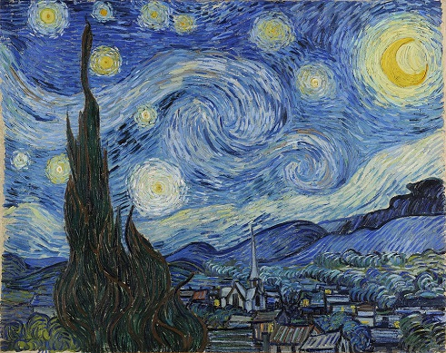
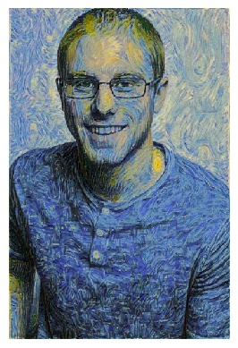
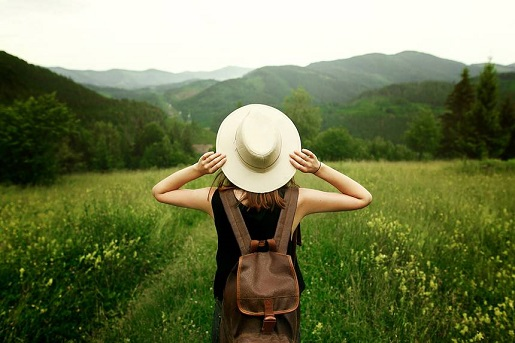
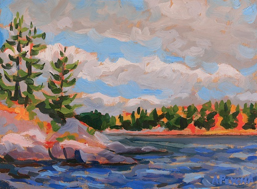
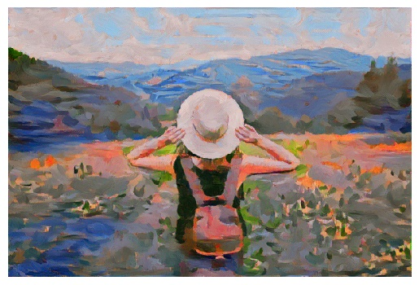
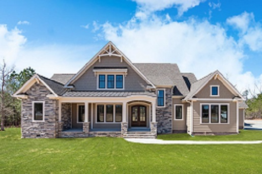
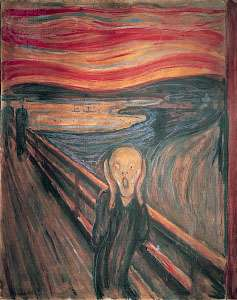
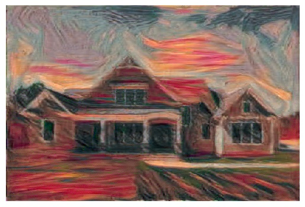

# StyleTransfer
A pretrained VGG19 network that transfers the style from one image onto the content of another. This was a project in [Udacity's deep learning program](https://www.udacity.com/course/deep-learning-nanodegree--nd101) which can be found [here](https://github.com/udacity/deep-learning-v2-pytorch/tree/master/style-transfer). Some examples created from the images in this repo can be found below:

|Content| Style                      | Transfer                          |
|:-------:| :--------------------------: | :---------------------------------: |
| |  |  |
||| |
||  |

## Downloads and Installations
These instructions assume two things: 
1. You have git installed on your machine. If you don't you can click [here](https://git-scm.com/book/en/v2/Getting-Started-Installing-Git) to set that up.
2. You have a package manager installed. These installation instructions use [conda](https://docs.conda.io/en/latest/) but [pip](https://pypi.org/project/pip/) works just as well to install the nessesary packages.

You can clone the repository with git:

`git clone https://github.com/Blade-Storm/StyleTransfer.git`

Open a terminal and change directory into the repository

`cd ../StyleTransfer`

Install the following packages if you dont already have them:
1. Python 3.7: `conda install python==3.7` 
2. Numpy 1.16: `conda install numpy==1.16`
3. Pytorch 1.1: `conda install pytorch=1.1`
4. Torchvision 0.3: `conda install torchvision=0.3`
5. Matplotlib 3.0: `conda install matplotlib==3.0`

## How to use
You will need at least two images, one style image and one content image, to create a target image that has the merged style and content. In the Images folder there are two subfolders: content and styles, where the content and style images will be pulled from. Additionally there is a folder for the target images to be saved. 

First, we need to do a forward pass on the neural network with the content and style images to get the features that will be mapped to the target image. This will create a two checkpoint files that will have the style grams and weights we want to use in the style transfer. One checkpoint file is a "low" profile of the style transfer that is saved halfway through the training process as well as a "high" profile of the style transfer that is saved at the end of the training. To do this we can run the `transfer_style.py` file like so:

`python transfer_style.py --content_dir './Images/content/house.jpg' --style_dir './Images/styles/abstract.jpg' --checkpoint_name "myStyleCheckpoint" --gpu --train --steps 6000 --show_every 1000`

Here is a list of all of the arguments you can use in the train along with an example:

1. `--content_dir`: The relative path to the content image file to train on. Required
2. `--style_dir`: The relative path to the style image file to train on. Required
3. `--checkpoint_name`: The name of the checkpoint to get or set
4. `--style_wegihts`: A list of style weights, as floats, to use from the convolutional layers. There are five weights that can range from 0 to 1. Default is: 1.0 0.8 0.5 0.3 0.1
5. `--steps`: The amount of steps (iterations) used for creating the target image. Default is 2000
6. `--show_every`: The amount of iterations to wait and show the progress of the target image. Default is 400
7. `--gpu`: If you would like to use the GPU for training. Default is False
8. `--target_image`: The name for target image. This will be used as the file name when saving.
9. `--train`: A boolean flag for if we are training a new style gram matrix. Default is False

### Using a pre-made style gram matrix for style transfer
Technically we arent training a model for the style transfer but using it to calculate the style gram matricies from the convolutional layers. In this project I store those value in the checkpoint file so we can do the style transfer without the original style image. To do so we can use the `transfer_style.py` file like so:

`python transfer_style.py --content_dir './Images/content/house.jpg' --checkpoint_name "myStyleCheckpoint-high.pth" --gpu --steps 6000 --show_every 1000`